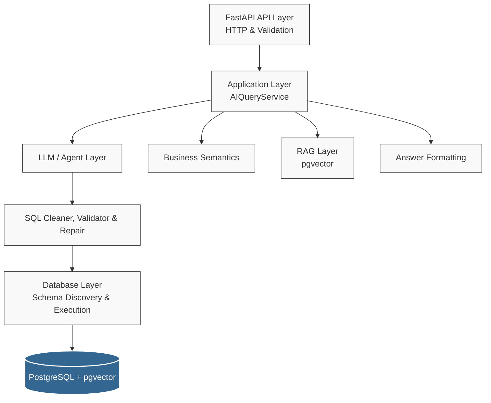

# DataCortex


**DataCortex** is an AI-powered natural-language-to-SQL backend that allows users to query relational databases using plain English.

Instead of allowing an LLM to directly access a database, DataCortex places validation, schema awareness, business rules, retrieved domain knowledge (RAG), and execution boundaries between the LLM and the database.

---

## 📑 Table of Contents

- [Quick Demo](#-quick-demo)
- [Architecture](#-architecture)
- [Core Workflow](#-core-workflow)
- [Key Features](#-key-features)
- [Configuration](#-configuration)
- [Project Structure](#-project-structure)
- [Testing & Code Quality](#-testing--code-quality)
- [CI](#-ci)
- [Technology Stack](#-technology-stack)
- [Getting Started](#-getting-started)
- [Security Principles](#-security-principles)
- [Roadmap](#-roadmap)
- [Engineering Goals](#-engineering-goals)

---

## 🚀 Quick Demo

Ask a question in plain English:

```bash
curl -X POST "http://127.0.0.1:8000/ai/query" \
     -H "Content-Type: application/json" \
     -d '{"question": "What are the top 5 products by total sales?"}'
```

**Generated SQL:**

```sql
SELECT
    p.name,
    SUM(oi.line_total) AS total_sales
FROM products p
JOIN order_items oi
    ON p.id = oi.product_id
GROUP BY p.name
ORDER BY total_sales DESC
LIMIT 5;
```

**Response:**

```json
{
  "question": "What are the top 5 products by total sales?",
  "sql": "SELECT p.name, SUM(oi.line_total) AS total_sales FROM products p JOIN order_items oi ON p.id = oi.product_id GROUP BY p.name ORDER BY total_sales DESC LIMIT 5;",
  "columns": ["name", "total_sales"],
  "rows": [
    {"name": "User-friendly multimedia firmware", "total_sales": "31642.81"}
  ],
  "row_count": 5,
  "answer": "1. User-friendly multimedia firmware — 31642.81",
  "truncated": false
}
```

The response is shortened for readability; the actual API returns all rows in the result set, up to the configured response row cap.

---

## 🏗 Architecture

DataCortex follows a layered architecture inspired by **Clean Architecture** principles, keeping business logic independent from HTTP handlers and AI components.



### Main Layers

- **API Layer:** Handles HTTP requests, validation, and responses using FastAPI.
- **Application Layer:** Coordinates the complete natural-language-to-database workflow through `AIQueryService`.
- **AI Layer:** Handles LLM interaction, prompt building, and the experimental agent/tool-calling capabilities.
- **RAG Layer:** Embeds the user's question and retrieves relevant business knowledge from PostgreSQL with pgvector.
- **Business Semantic Layer:** Defines domain-specific meanings that cannot safely be inferred from the database structure alone (for example `total_sales`, `product_sales`, `order_subtotal`, `order_total`).
- **Database Layer:** Schema discovery, SQL execution, SQL validation, database adapters, and database-specific behavior.
- **Formatting Layer:** Converts database results into deterministic, human-readable responses.
- **Infrastructure:** Docker, PostgreSQL with pgvector, Ollama, configuration, and local development tooling.

---

## 🔄 Core Workflow

1. **User Question:** FastAPI receives the request.
2. **Question Guards:** Write requests and unanswerable questions are rejected early.
3. **Schema Discovery:** The allowed tables and columns are read from the configured schema.
4. **Business Semantics:** Explicit business rules are injected into the prompt.
5. **RAG Retrieval:** Relevant business knowledge is found by cosine similarity.
6. **LLM Text-to-SQL:** The LLM generates a SQL query, or `CANNOT_ANSWER` if the data does not exist.
7. **SQL Cleaning & Validation:** The generated SQL is treated as *untrusted input* and validated against the schema and the security and semantic rules.
8. **SQL Repair:** If validation fails, a deterministic repair is attempted first, then an LLM repair prompt. The repaired query must pass validation again.
9. **Execution:** The validated query runs on PostgreSQL.
10. **Deterministic Formatting:** Results are turned into a readable answer *without* asking the LLM to summarize the data.

---

## 🔑 Key Features

### 🛡️ Strict SQL Validation

Generated SQL is never executed blindly. The validator checks that the query:

- is a `SELECT` statement
- contains no destructive operations (`DROP`, `DELETE`, `UPDATE`, ...)
- uses only tables and columns that exist in the discovered schema
- respects the business semantic rules

Write requests are also rejected earlier, at the question level, before any SQL is generated. If both repair attempts fail, the API reports that the requested data is not available instead of executing unvalidated SQL.

### 📖 Business Semantic Layer

Database schemas describe *how data is stored*, not *what business concepts mean*. For example, "total sales" cannot be answered safely from column names alone, because the database contains `products.price`, `order_items.line_total`, `orders.subtotal`, and `orders.total_amount`.

DataCortex defines it explicitly:

```text
total_sales = SUM(order_items.line_total)
```

The LLM is prevented from interpreting it as `SUM(products.price)` or `SUM(orders.total_amount)`.

### 🧠 Retrieval-Augmented Generation (RAG)

```text
Knowledge documents
        │
        ▼
 Embedding (all-MiniLM-L6-v2, 384 dimensions)
        │
        ▼
 datacortex.knowledge_documents (VECTOR(384))
        │
        ▼
 Cosine-distance search for the user's question
        │
        ▼
 Top-k documents above the similarity threshold
        │
        ▼
 Added to the SQL generation prompt
```

- Knowledge documents are stored with an upsert, so seeding is repeatable.
- Similarity is `1 - cosine_distance`. `RAGService` keeps results at or above a configurable threshold (default `0.30`, chosen to match the score range of the default model).
- The model is configurable through `EMBEDDING_MODEL`. The `VECTOR(384)` column must match the model's output size, and documents must be re-seeded after changing the model.
- The embedding model is loaded once per process and shared by every `EmbeddingService` instance.
- Retrieved knowledge is supporting context. Business semantics remain mandatory rules.

### 🔍 Entity Resolution

Maps natural-language references to database entities. For example, "Apple" can be resolved to `Apple Inc.`, `Apple Store`, or `Apple Services` using text normalization and semantic matching with a similarity threshold, or to no match when nothing is close enough.

### ✅ Deterministic Answers

The final response is generated from the database result rather than from an LLM summary:

```text
1. User-friendly multimedia firmware — 31642.81
2. Enhanced didactic moratorium — 24842.32
3. Polarized needs-based Graphic Interface — 22509.07
```

This keeps formatting predictable and avoids unnecessary LLM usage after the database has produced the authoritative result.

### 🛠 Experimental Agent & Tool Calling

The project includes a foundation for exposing database operations as tools to an LLM-based agent. The main production path deliberately uses the deterministic Text-to-SQL → Validation → Execution pipeline instead of depending on tool selection by a small local model.

### 🗄 Database Abstraction

A database adapter layer keeps database-specific SQL behavior replaceable. PostgreSQL is the only database with end-to-end support today. The abstraction contains adapter concepts for MySQL and SQL Server, but the project does not claim production support for them.

### 🤖 Local LLM

The local development setup uses Ollama with Qwen 2.5 Coder 1.5B for SQL generation and repair. The LLM sits behind a service layer, so the model or provider can be replaced (other local models, OpenAI-compatible APIs, hosted providers) without changing the rest of the application.

---

## ⚙️ Configuration

Configuration is read from environment variables, with a local `.env` file as a fallback. Priority: environment variables, then `.env`, then the defaults in `app/core/config.py`.

| Variable             | Required | Default            | Description                              |
| :------------------- | :------: | :----------------- | :--------------------------------------- |
| `APP_NAME`           | yes      |                    | Application name                         |
| `APP_VERSION`        | yes      |                    | Application version                      |
| `POSTGRES_DB`        | yes      |                    | Database name                            |
| `POSTGRES_USER`      | yes      |                    | Database user                            |
| `POSTGRES_PASSWORD`  | yes      |                    | Database password                        |
| `POSTGRES_HOST`      | yes      |                    | Database host                            |
| `POSTGRES_PORT`      | yes      |                    | Database port                            |
| `POSTGRES_SCHEMA`    | no       | `datacortex`       | Schema that holds the application tables |
| `OLLAMA_BASE_URL`    | yes      |                    | Ollama server URL                        |
| `OLLAMA_MODEL`       | yes      |                    | Ollama model name                        |
| `OLLAMA_TEMPERATURE` | no       | `0.0`              | Sampling temperature                     |
| `OLLAMA_NUM_CTX`     | no       | `8192`             | Context window size                      |
| `EMBEDDING_MODEL`    | no       | `all-MiniLM-L6-v2` | Embedding model used for RAG             |

The application connects with `search_path` set to the configured schema, so table names in generated SQL resolve to the application schema regardless of the database user's name. Never commit secrets: keep credentials in `.env` (see `.env.example`) or in the environment.

---

## 📁 Project Structure

```text
DataCortex/
│
├── app/
│   ├── api/
│   │   └── routes/
│   │
│   ├── core/
│   │   └── config.py
│   │
│   ├── database/
│   │   ├── connection.py
│   │   ├── database.py
│   │   ├── dialect.py
│   │   ├── health.py
│   │   ├── query.py
│   │   ├── rag_models.py
│   │   ├── reset.py
│   │   ├── schema.py
│   │   ├── security.py
│   │   ├── semantics.py
│   │   ├── sql_repair.py
│   │   ├── sql_semantic_validator.py
│   │   ├── sql_validator.py
│   │   ├── seed/
│   │   └── sql/
│   │       └── schema.sql
│   │
│   ├── schemas/
│   │   ├── ai_query.py
│   │   ├── database.py
│   │   ├── knowledge.py
│   │   └── query.py
│   │
│   ├── services/
│   │   ├── agent.py
│   │   ├── ai_query.py
│   │   ├── answer.py
│   │   ├── embedding.py
│   │   ├── entity_resolution.py
│   │   ├── exceptions.py
│   │   ├── knowledge.py
│   │   ├── llm.py
│   │   ├── question_guard.py
│   │   ├── rag.py
│   │   ├── rag_repository.py
│   │   ├── result_formatter.py
│   │   ├── sql_cleaner.py
│   │   ├── sql_prompt.py
│   │   ├── sql_repair_prompt.py
│   │   ├── text_to_sql.py
│   │   └── tools.py
│   │
│   └── main.py
│
├── tests/
├── .github/workflows/ci.yml
├── Dockerfile
├── compose.yaml
├── pyproject.toml
├── requirements.txt
└── README.md
```

---

## 🧪 Testing & Code Quality

Testing is a core pillar of DataCortex. The suite covers API endpoints, SQL generation prompts, SQL validation (security and semantic rules), SQL repair, schema discovery, database execution, business semantics, RAG retrieval and the vector store repository, entity resolution, question guards, result formatting, and answer generation.

```bash
$ pytest -q
178 passed, 1 warning
```

The embedding model is loaded once and cached, so the full suite runs in about 20 seconds on a laptop CPU.

The tests run against a real PostgreSQL database, so the schema must be created and seeded first (see [Getting Started](#-getting-started)).

**Code quality automation:**

- ✅ **Ruff:** linting and formatting
- ✅ **Pre-commit:** hooks that catch issues before they are committed
- ✅ **GitHub Actions:** CI on every push and pull request to `main`

```bash
ruff check .
ruff format --check .
pre-commit run --all-files
```

---

## 🔁 CI

GitHub Actions runs on pushes and pull requests to `main`. The workflow:

1. starts a PostgreSQL service with pgvector (`pgvector/pgvector:pg17`)
2. installs dependencies
3. runs Ruff lint and format checks
4. creates the database schema from `schema.sql`
5. seeds the database, including knowledge documents and embeddings
6. runs the test suite

---

## 🛠 Technology Stack

| Technology                | Purpose                                     |
| :------------------------ | :------------------------------------------ |
| **Python**                | Core application language                   |
| **FastAPI**               | REST API                                    |
| **PostgreSQL + pgvector** | Primary database and vector similarity search |
| **SQLAlchemy / psycopg**  | Database abstraction and driver             |
| **sentence-transformers** | Local embeddings (`all-MiniLM-L6-v2`)       |
| **Ollama / Qwen 2.5 Coder** | Local LLM runtime for SQL generation      |
| **SQLGlot**               | SQL parsing and analysis                    |
| **Pydantic**              | Data validation and settings management     |
| **Docker / Compose**      | Containerized local development             |
| **Pytest**                | Automated testing                           |
| **Ruff / Pre-commit**     | Code quality and formatting                 |
| **GitHub Actions**        | CI                                          |

---

## 🚀 Getting Started

### 1. Clone and set up

```bash
git clone git@github.com:MotahareFallah/DataCortex.git
cd DataCortex
python -m venv .venv
source .venv/bin/activate
pip install -r requirements.txt
```

### 2. Configure environment variables

Create a `.env` file based on `.env.example` and update the database credentials and Ollama settings. Do not commit secrets to Git.

### 3. Start PostgreSQL

The database image includes the pgvector extension:

```bash
docker compose up -d db
```

### 4. Create the schema and seed the data

Create the extension, the `datacortex` schema, and all tables:

```bash
docker compose exec -T db sh -c 'psql -U "$POSTGRES_USER" -d "$POSTGRES_DB"' < app/database/sql/schema.sql
```

Seed the sample data and the knowledge documents. This also computes the document embeddings, so the first run downloads the embedding model:

```bash
python -m app.database.seed
```

### 5. Start Ollama

```bash
OLLAMA_HOST=0.0.0.0:11434 ollama serve
ollama list   # make sure the required model is available
```

### 6. Start the API

```bash
uvicorn app.main:app --reload
```

The API is available at `http://127.0.0.1:8000`, and the interactive documentation at `http://127.0.0.1:8000/docs`.

### Running with Docker

```bash
docker compose up --build
```

The application container runs the FastAPI service and connects to PostgreSQL through the Docker network. The schema and seed steps above still need to be run once against the database. The container reaches the host Ollama service through `host.docker.internal`.

---

## 🔒 Security Principles

AI-generated SQL is never considered safe simply because an LLM produced it.

```text
LLM Output → SQL Cleaning → SQL Validation → Schema Validation → Database Execution
```

- allow only intended SQL operations
- validate generated SQL before execution
- validate tables and columns against the discovered schema
- never trust LLM-generated identifiers
- keep database credentials outside source control
- use environment variables for configuration
- isolate infrastructure with Docker where appropriate

---

## 🗺 Roadmap

- [ ] Authentication and authorization
- [ ] Query caching and performance optimization
- [ ] Streaming responses
- [ ] Richer database adapters
- [ ] Richer knowledge ingestion for RAG (documents, schema descriptions)
- [ ] Advanced RAG workflows (hybrid search, re-ranking)
- [ ] Query observability, tracing, and cost estimation
- [ ] Rate limiting
- [ ] Web-based analytics interface

---

## 🎯 Engineering Goals

1. **AI is constrained by application rules.** The LLM is a tool, not the source of truth.
2. **LLM output is untrusted input.** It must be validated before touching the database.
3. **Business semantics are explicit.** They are enforced programmatically, not inferred blindly.
4. **Database access stays behind application boundaries.**
5. **AI components are replaceable.**
6. **Deterministic over probabilistic.** Validation and formatting rely on code, not LLM guesses.
7. **Critical behavior is covered by automated tests.**
